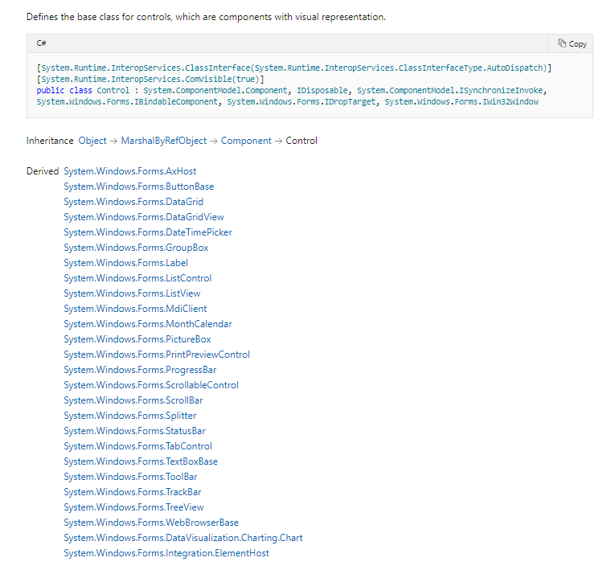

## 控件种类说明

Describes the different kinds of custom controls you can author with the System.Windows.Forms namespace

* Base Control Class - 基本控制类

The Control class is the base class for Windows Forms controls. It provides the infrastructure required for visual display in Windows Forms applications
控件类是 Windows 窗体控件的基类。它提供了在 Windows 窗体应用程序中可视化显示所需的基础结构，如下图所示是Winform自带的基本控件类。

To create your own control class, inherit from the UserControl, Control classes, or from the other Windows Forms provided controls

The Control class implements very basic functionality required by classes that display information to the user. It handles user input through the keyboard and pointing devices. It handles message routing and security. It defines the bounds of a control (its position and size), although it does not implement painting. It provides a window handle 

Windows 窗体支持三种用户定义的控件：复合控件、扩展控件和自定义控件。以下各节介绍每种控件，并给出选择项目使用方式的建议

* Composite Controls - 复合控件

A composite control is a collection of Windows Forms controls encapsulated in a common container. This kind of control is sometimes called a user control. The contained controls are called constituent controls.

复合控件是封装在公共容器中的 Windows 窗体控件的集合。这种控件有时称为用户控件，包含的控件称为组成控件。
复合控件保存与每个包含的 Windows 窗体控件关联的所有固有功能，并使您能够有选择地公开和绑定其属性，复合控件还提供大量默认键盘处理功能，无需额外的开发工作。

可以构建一个复合控件来显示来自数据库的客户地址数据。此控件可以包括用于显示数据库字段的 DataGridView控件、用于处理对数据源绑定的绑定源以及用于在记录中移动的绑定导航器控件。您可以有选择地公开数据绑定属性，也可以从应用程序打包并重新重用整个控件。

>> 使用场景：
**希望将多个 Windows 窗体控件的功能合并到一个可重用单元中，使用这种方式**

* Extended Controls - 扩展控件

You can derive an inherited control from any existing Windows Forms control. With this approach, you can retain all of the inherent functionality of a Windows Forms control, and then extend that functionality by adding custom properties, methods, or other features. With this option, you can override the base control's paint logic, and then extend its user interface by changing its appearance

可以从任何现有的 Windows 窗体控件派生继承的控件。使用此方法，您可以保留 Windows 窗体控件的所有固有功能，然后通过添加自定义属性、方法或其他功能来扩展该功能。使用此选项，可以重写基控件的绘制逻辑，然后通过更改其外观来扩展其用户界面。例如，可以创建从 Button 控件派生的控件，该控件跟踪用户单击它多少次。

>> 使用场景：
**所需的大多数功能已经与现有的 Windows 窗体控件相同；不需要自定义图形用户界面，或者希望为现有控件设计新的图形用户界面**

* Custom Controls - 自定义控件

Another way to create a control is to create one substantially from the beginning by inheriting from Control. The Control class provides all of the basic functionality required by controls, including mouse and keyboard handling events, but no control-specific functionality or graphical interface

创建控件的另一个方法就是从控件继承，从一开始就创建一个控件。Control 类提供控件所需的所有基本功能，包括鼠标和键盘处理事件，但没有特定于控件的功能或图形界面。

通过从 Control 类继承来创建控件需要比从 UserControl 或现有Windows 窗体控件继承更多的思考和工作量。由于需要大量实现，因此控件可以比复合控件或扩展控件具有更大的灵活性，并且您可以根据确切需求定制控件。
若要实现自定义控件，必须为控件的OnPaint事件以及所需的任何特定于功能的代码编写代码，还可以重写WndProc 方法并直接处理窗口消息

## Windows Forms Control Development Basics

A Windows Forms control is a class that derives directly or indirectly from System.Windows.Forms.Control. The following list describes common scenarios for developing Windows Forms controls。

* Combining existing controls to author a composite control - 组合现有控件以创作复合控件
要创作复合控件，请从System.Windows.Forms.userControl 派生。基类UserControl为子控件提供键盘路由，使子控件能够作为一个组工作

* Extending an existing control to customize it or to add to its functionality - 扩展现有控件以自定义控件或将其添加到其功能

无法更改其颜色的按钮以及具有跟踪其单击次的附加属性的按钮是扩展控件的示例。您可以通过从中派生并覆盖或添加属性、方法和事件来自定义任何 Windows 窗体控件

* Authoring a control that does not combine or extend existing controls

在这种情况下，从基类控件派生控件。您可以添加和覆盖基类的属性、方法和事件

Windows 窗体控件的基类"控件"提供了在基于客户端的 Windows 应用程序中可视化显示所需的管道。控件提供窗口句柄，处理消息路由，并提供鼠标和键盘事件以及许多其他用户界面事件。它提供了高级布局，并且具有特定于视觉显示的属性，如前色、背面颜色、高度、宽度和许多其他。此外，它还提供安全性、线程支持以及与 ActiveX 控件的互操作性。由于许多基础结构是由基类提供的，因此开发自己的 Windows 窗体控件相对容易

